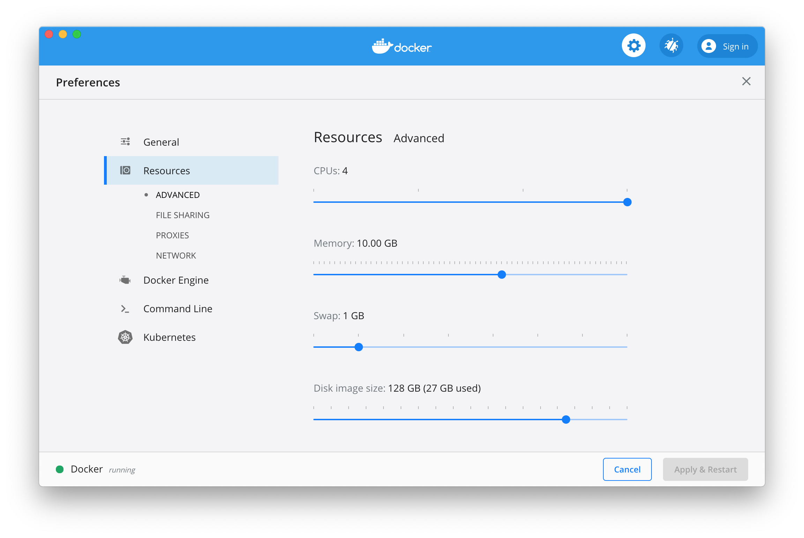

# Install

Hardware requirements: while the stack in itself is not necessarily heavy, you will need sufficient resources to run all your projects and diskspace to store them. You'll need at least 8GB of RAM (16GB reccomended) and modern host (SSD, new processor) to run comfortably.
We also assume common utilities are present:
- git
- curl
- gunzip

## Linux
### Requirements
#### Docker
Follow the installation instructions for your distro from https://docs.docker.com/engine/install/. It is generally straightforward, except for users of [Fedora 31 and above](https://duckduckgo.com/?q=docker+fedora+32).

***Shall I `sudo docker` or `docker`?***
Most setup instructions you will find online instruct you to [add your user to the "docker" group](https://docs.docker.com/engine/install/linux-postinstall/) to be able to call docker as a standard user.
There is a [non-neglectable risk](https://docs.docker.com/engine/security/security/#docker-daemon-attack-surface) with that approach, even though it is far more convenient than being prompted for your password each and every step.

By default, ce-dev will assume you went the "safe" way and use `sudo docker` or `sudo docker-compose`, but you can change that in your [global configuration](config).

#### Docker Compose
Follow the installation instruction for your distro from https://docs.docker.com/compose/install/.

#### mkcert
Follow the instructions frow https://github.com/FiloSottile/mkcert#linux and make sure to have nss/certutil installed. On a successful install, running `mkcert install` should output something along the lines of:

```
Using the local CA at "/home/XXX/.local/share/mkcert" ✨
The local CA is already installed in the system trust store! 👍
The local CA is already installed in the Firefox and/or Chrome/Chromium trust store! 👍
```
Make sure to restart your browsers after installing.

#### inotify watcher limit
To leverage the [Unison](https://github.com/bcpierce00/unison) file mounting (see [Mounts](unison) as to why you'd want to use that on Linux at all in the first place), we need to change the default limits for `inotify` watchers.
On most systems, you can check what the current value is with:

```
cat /proc/sys/fs/inotify/max_user_watches
```
and/or 
```
sudo sysctl fs.inotify.max_user_watches
```
The default value is often `8192`, which is far too low. You must change this to a more suitable number, usually `65536`. The location of the `inotify` config is different on different systems, so you'll need to re-search it for your distribution.

The most common method you'll find by Googling usually is along the lines of:
```
echo fs.inotify.max_user_watches=65536 | sudo tee -a /etc/sysctl.conf
sudo sysctl -p # Or better yet, reboot.
```
Nowadays, though, this is slowly being deprecated, and should instead be set through sysctl directly:
```
sysctl -n -w fs.inotify.max_user_watches=65536
sudo sysctl -p # Or better yet, reboot.
```

### Install
To install ce-dev itself, use this one-liner:
```
curl -sL https://raw.githubusercontent.com/codeenigma/ce-dev/1.x/install/linux.sh | /bin/sh
```
*note for the "I don't trust your install script" crowd out there... 1. Just follow the link to see what this script does. 2. If you don't trust the install script, why would you trust the rest of the program in the first place?*

## Mac
### Requirements
#### Docker Desktop
Follow the installation instructions from https://docs.docker.com/engine/install/.

Be sure to allow enough resources for it to run smoothly. There's no magic rule, and it will depends on your host and needs, but we found the following to be decent defaults:
- Be generous on RAM, but do not allocate it all for Docker. If you do not set a limit and you run a resource hungry service, everything, including processes on the hosts (think Electron apps, Chrome and the like, and by cascade the Docker processes themselves) will end up swapping and being ultra slow. 8GB or 10GB out of 16GB should be reasonable values.
- Do not throttle CPU usage (ie, allocate them all). Or, go the other way round and allocate only one. This seems contradictory, but it looks like it behave diffently based on your hardware and/or OS version. In certain cases, containers seem to be unable to make use of more than one core anyway, so allocating more than one ends up being counter-productive as it will impede processes on the host.
- Make sure you have enough disk space allocated for the VM Disk image. This again will vary on usage, but with a dozen of projects that have a 10GB database each, you're already well over 100GB. On the other hand, ***you can always grow the virtual disk afterward, but you can NOT shrink it without destroying all containers and volumes***, so you can start small and grow it as needed if you encounter some "no space left on device/disk full" errors.

[](uploads/docker-mac-settings.png)

#### Docker Compose
Docker Compose is bundled with Docker Desktop already.

#### mkcert
Follow the instructions from https://github.com/FiloSottile/mkcert#macos and triple check nss/certutil installed. On a successful install, running `mkcert install` should output something along the lines of:

```
Using the local CA at "/Users/XXX/.local/share/mkcert" ✨
The local CA is already installed in the system trust store! 👍
The local CA is already installed in the Firefox and/or Chrome/Chromium trust store! 👍
```
Make sure to restart your browsers after installing.

### Install
To install ce-dev itself, use this one-liner:
```
curl -sL https://raw.githubusercontent.com/codeenigma/ce-dev/1.x/install/mac.sh | /bin/sh
```
*note for the “I don’t trust your install script” crowd out there… 1. Just follow the link to see what this script does. 2. If you don’t trust the install script, why would you trust the rest of the program in the first place?*